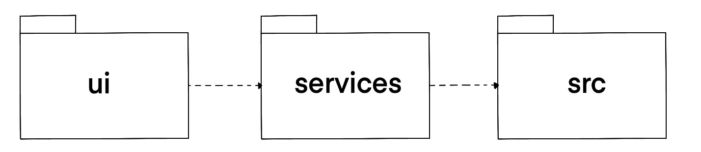
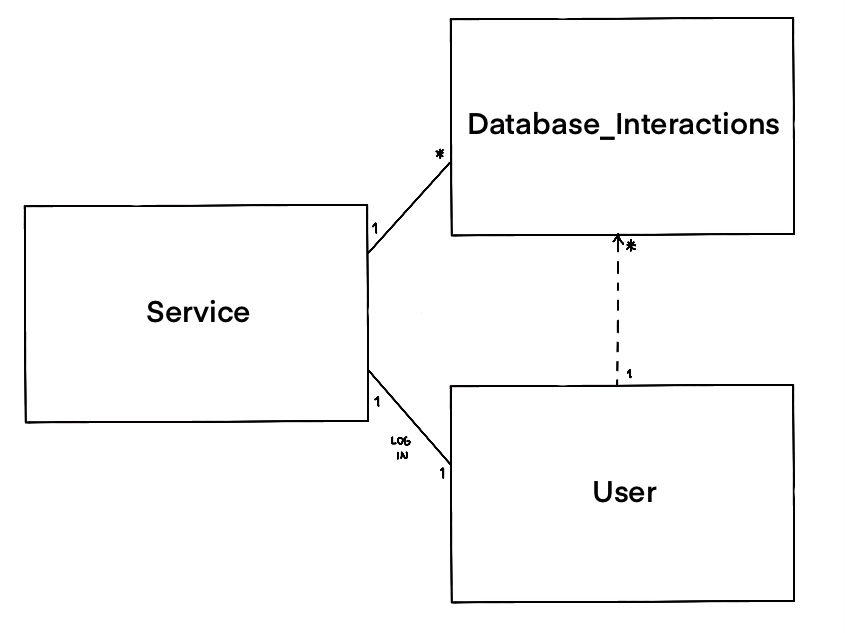
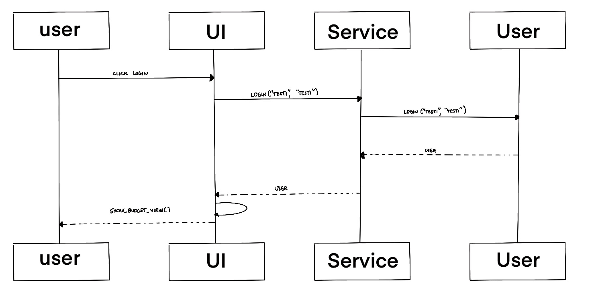

# Arkkitehtuurikuvaus

## Rakenne

Koodin pakkauskaavio on seuraava:

Pakkaus *ui* sisältää käyttöliittymän, *services* sovelluslogiikan ja *src* tallennuksen koodin.

## Käyttöliittymä

Käyttöliittymä sisältää erilaisia näkymiä:

- Kirjautuminen
- Rekisteröityminen
- Käyttäjän poistaminen
- Päänäkymä, tietoja tilitiedoista
- Tietojen lisääminen
- Käteisen lisääminen
- Käteisostojen lisääminen

Jokainen on oma luokkansa ja vain yksi näkymistä näkyy kerrallaan.

## Sovelluslogiikka

## Tietojen tallennus

Sovellus tallentaa käyttäjä- ja tilitiedot SQLite-tietokantaan tauluihin Users ja Accounts. Tietoja voi lisätä käsin käteisostoina tai csv-tiedoston avulla automaattisesti.

## Päätoiminnallisuudet

### Käyttäjän kirjaantuminen

Kun kirjautumisnäkymään syötetään käyttäjätunnus ja salasana ja klikataan *Kirjaudu sisään*, etenee sovelluksen kontrolli seuraavasti.

Kun painiketta painetaan kutsutaan `Service`:n metodia login antaen parametriksi käyttäjätunnuksen ja salasanan. Metodi kutsuu `User`:n metodia login, joka hakee tietokannasta käyttäjän ja tarkistaa onko annettu salasana sama kuin tietokannassa oleva salasana. Jos on, kirjautuminen onnistuu ja palautetaan käyttäjän id. Tämän seurauksena käyttöliittymä vaihtaa näkymäksi `BudgetView`:n eli sovelluksen varsinaisen päänäkymän ja näyttää kirjautuneen käyttäjän tilitietoja.

### Muut toiminnallisuudet 

Sama periaate toistuu sovelluksen kaikissa toiminnallisuuksissa, käyttöliittymä kutsuu sovelluslogiikan metodia ja se päivittää tilitietoja tai käyttäjän tilaa. Palatessa käyttöliittymään päivitetään tilitiedot.
