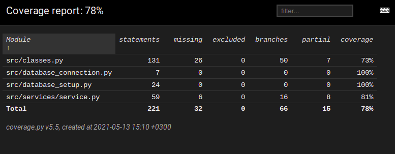

# Testausdokumentti

Ohjelmaa on testattu unittestilla ja manuaalisesti järjestelmätason testein.

## Unittest-testaus

### Tietokanta

Tietokannasta vastaavaa `database`-luokkaa testataan [TestDataBase](https://github.com/Siihi/ot-harjoitustyo/blob/master/src/tests/database_setup_test.py)-testiluokalla.

### Sovelluslogiikka

Sovelluslogiikasta vastaavaa `Service`-luokkaa testataan [TestService](https://github.com/Siihi/ot-harjoitustyo/blob/master/src/tests/service_test.py)-testiluokalla.

### Tietokantaan lisääminen

Tietokantaan lisäämisestä vastaavat `User`- ja `Database_Interactions`-luokat testataan [TestUser ja TestDatabase_Interactions](https://github.com/Siihi/ot-harjoitustyo/blob/master/src/tests/classes_test.py)-testiluokilla.

### Testauskattavuus

Käyttöliittymää lukuun ottamatta sovelluksen testauksen kattavuus on 78%.

## Järjestelmätestaus

Järjestelmätestaus on tehty manuaalisesti.

### Asennus ja konfigurointi

Sovellus on haettu ja testattu Linux-ympäristössä.

### Toiminnallisuudet

Kaikki [määrittelydokumentin](https://github.com/Siihi/ot-harjoitustyo/blob/master/dokumentaatio/vaatimusmaarittely.md) listaamat toiminnallisuudet on käyty läpi ja testattu. Kaikkien toiminnallisuuksien yhteydessä on syötekentät täytetty möys virheellisillä arvoilla.

## Sovellukseen jääneet laatuongelmat

Sovellus ei anna virheilmoituksia jos:
- csv-tiedostoihin ei ole lukuoikeuksia
